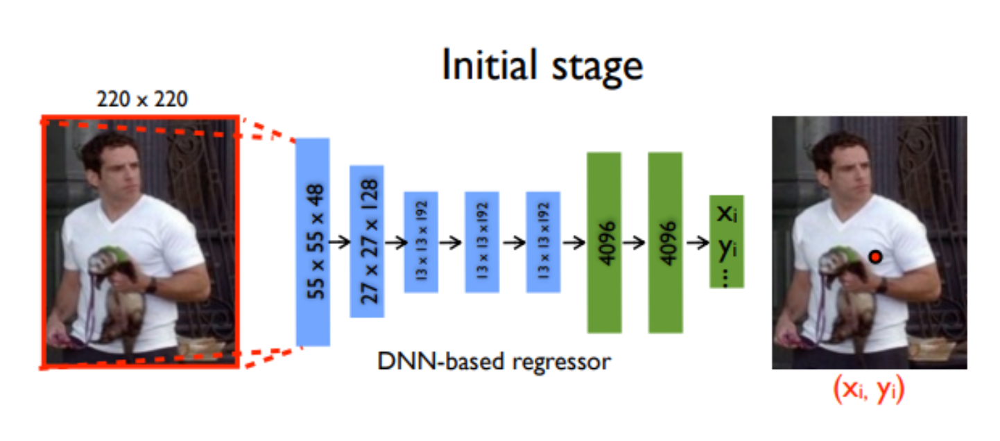

# Important Paper

## 1#DeepPose: Human Pose Estimation via Deep Neural Network(CVPR’14)[[arxiv]](https://arxiv.org/pdf/1312.4659.pdf)

In this paper，pose estimation is formulated as a CNN-based regression problem towards body joints.

The model consisted of an AlexNet backend (7 layers) with an extra final layer that outputs 2k joint coordinates 

The model is trained using a L2L2 loss for regression.

 ## 2#Efficient Object Localization Using Convolutional Networks(CVPR’15)[[arxiv]](https://arxiv.org/pdf/1411.4280)

The output is a discrete heatmap instead of continuous regression. 

Using heatmap indict the probability of k-th point.

Model : A multi-resolution CNN architecture (coarse heatmap model) is used to implement a sliding window detector to produce a coarse heatmap output.

In essence, the model consists of the heat-map-based parts model for coarse localization, a module to sample and crop the convolution features at a specified (x,y)(x,y) location for each joint, as well as an additional convolutional model for fine-tuning.

## 3#Convolutional Pose Machines(CVPR’16)[[arxiv]](https://arxiv.org/pdf/1602.00134.pdf)[[Code]](https://github.com/shihenw/convolutional-pose-machines-release)

Convolutional Pose Machines are completely differentiable and their multi-stage architecture can be trained end to end. They provide a sequential prediction framework for learning rich implicit spatial models and work very well for Human pose.

*g1()* and *g2()* predict heatmaps (belief maps in the paper)

Stage 1 is fixed and stages > 2 are just repetitions of Stage 2. Stage 2 take heatmaps and image evidence as input. The input heatmaps add spatial context for the next stage. (Has been discussed in detail in the paper).

## 4#Human Pose Estimation with Iterative Error Feedback (CVPR’16) [[arXiv\]](https://arxiv.org/pdf/1507.06550) [[code\]](https://github.com/pulkitag/ief)

To quote the authors, Instead of directly predicting the outputs in one go, they use a self-correcting model that progressively changes an initial solution by feeding back error predictions, and this process is called Iterative Error Feedback (IEF).

Let’s jump right to the model pipeline.

- The input consists of the image I and a representation of the previous output $y_{t−1}$ . Keep in mind this is an iterative process and the same output is refined over steps.

- Input, $x_t = I⊕g(y_t−1)$ , where $I$ is the image and $y_{t−1}$ is the previous output

  - $f(x_t)$ outputs the correction $ε_t $ and this added to the current output $y_t$ to generate $y_{t+1}$, which takes the corrections into account.
  - $g(y_{t+1})$converts each keypoint in $y_{t+1}$ into a heatmap channel so they can be stacked to the image $I$ , so as to form the input for the next teration. This process is repeated $T$ times till we get a refined $y_{t+1}$ and is brought closer to the ground truth by the addition of $ε_t$

- $f()$ and $g()$ are learnable and $f()$ is a CNN

### Example

## 5#Stacked Hourglass Networks for Human Pose Estimation (ECCV’16) [[arXiv\]](https://arxiv.org/pdf/1603.06937.pdf) [[code\]](https://github.com/princeton-vl/pose-hg-train)

This is a landmark paper that introduced a novel and intuitive architecture and beat all previous methods. It’s called a stacked hourglass network since the network consists of steps of pooling and upsampling layers which looks like an hourglass, and these are stacked together. The design of the hourglass is motivated by the need to capture information at every scale. While local evidence is essential for identifying features like faces hands, a final pose estimate requires global context. The person’s orientation, the arrangement of their limbs, and the relationships of adjacent joints are among the many cues that are best recognized at different scales in the image (Smaller resolutions capture higher order features and global context).

The network performs repeated bottom-up, top-down processing with intermediate supervision
\- Bottom-up processing (from high resolutions to low resolutions)
\- Top-down processing (from low resolutions to high resolutions)

The network uses skip connections to preserve spatial information at each resolution and passes it along for upsampling, further down the hourglass.

Each box is a  residual module like the below figure;

Intermediate supervision is applied to the predictions of each hourglass stage, i.e the predictions of each hourglass in the stack are supervised, and not only the final hourglass predictions.

## 6#Simple Baselines for Human Pose Estimation and Tracking (ECCV’18) [[paper\]](https://arxiv.org/pdf/1804.06208) [[code\]](https://github.com/Microsoft/human-pose-estimation.pytorch)

The previous approaches work very well but are complex. This work follows the question – *how good could a simple method be?* And achieved the state-of-the-art at mAP of 73.7% on COCO.

The network structure is quite simple and consists of a ResNet + few deconvolutional layers at the end. (Probably the simplest way to estimate heat maps)

While the hourglass network uses upsampling to increase the feature map resolution and puts convolutional parameters in other blocks, this method combines them as deconvolutional layers in a very simple way. It was quite surprising to see such a simple architecture perform better than one with skip connections that preserve the information for each resolution.

Mean Squared Error (MSE) is used as the loss between the predicted heatmaps and targeted heatmaps. The targeted heatmap HkHk for joint kk is generated by applying a 2D Gaussian centered on the kth joint’s ground truth location with std dev = 1 pixel.

## 7#Deep High-Resolution Representation Learning for Human Pose Estimation [HRNet] (CVPR’19) [[arXiv\]](https://arxiv.org/pdf/1902.09212.pdf) [[code\]](https://github.com/leoxiaobin/deep-high-resolution-net.pytorch)

The HRNet (High-Resolution Network) model has outperformed all existing methods on Keypoint Detection, Multi-Person Pose Estimation and Pose Estimation tasks in the COCO dataset and is the most recent. HRNet follows a very simple idea. Most of the previous papers went from a high → low → high-resolution representation. HRNet *maintains* a high-resolution representation throughout the whole process and this works very well.

The architecture starts from a high-resolution subnetwork as the first stage, and gradually adds high-to-low resolution subnetworks one by one to form more stages and connect the multi-resolution subnetworks in parallel.

Repeated multi-scale fusions are conducted by exchanging information across parallel multi-resolution subnetworks over and over through the whole process.

Another pro is that this architecture does not use intermediate heatmap supervision, unlike the Stacked Hourglass.

Heatmaps are regressed using an MSE loss, similar to simple baselines. (add in article link)

## 8#OpenPose: Realtime Multi-Person 2D Pose Estimation using Part Affinity Fields[[arxiv]](rxiv.org/pdf/1812.08008.pdf)

Botton-up,  detect some keypoint first, then draw a whole skeleton. However, most method using Top-down  method, get bounding box of people, the regress the keypoint.

S: key point confidence map

L: PAF, bone.

Many efforts focus on how to divide key point into different people.

## 9#DensePose: Dense Human Pose Estimation In The Wild[[arxiv]](https://arxiv.org/pdf/1802.00434v1.pdf)

Bulid a new dataset based on MSCOCO, and they have their own labeling tool,( seems not open-source), label surface of body.

In this model, a single RGB image is taken as input and used to establish a correspondence between surface points and image pixels.

The authors have combined the Dense Regression (DenseReg) system with the Mask-RCNN architecture to come up with the DensePose-RCNN system.

The model uses a fully-convolutional network that’s dedicated to generating a classification and a regression head for assignment and coordinate predictions. The authors use the same architecture used in the keypoint branch of MaskRCNN. It consists of a stack of 8 alternating 3×3 fully convolutional and ReLU layers with 512 channels.

## 10#RMPE: Regional Multi-Person Pose Estimation(AlphaPose)[[arxiv]](https://arxiv.org/pdf/1612.00137.pdf)[[code]](https://github.com/MVIG-SJTU/AlphaPose)

Focus on Mutli-person. (\Skip)

## 10#CrowdPose: Efficient Crowded Scenes Pose Estimation and A New Benchmark(CVPR2019)[[arxiv]](http://openaccess.thecvf.com/content_CVPR_2019/papers/Li_CrowdPose_Efficient_Crowded_Scenes_Pose_Estimation_and_a_New_Benchmark_CVPR_2019_paper.pdf)[[code]](https://github.com/Jeff-sjtu/CrowdPose)

Focus on Mutli-person. (\Skip)

## 11#Human Pose Estimation for Real-World Crowded Scenarios(AVSS2019)[[arxiv]](https://arxiv.org/pdf/1907.06922.pdf)

Focus on Mutli-person. (\Skip)

# Metric

**Percentage of Correct Parts - PCP:** A limb is considered detected  (a correct part) if the distance between the two predicted joint locations and the true limb joint locations is less than half of the limb length (Commonly denoted as PCP@0.5).

- It measures the detection rate of limbs. The con is that it penalizes shorter limbs more since shorter limbs have smaller thresholds.
- Higher the PCP, better the model.

**Percentage of Correct Key-points - PCK:** A detected joint is considered *correct* if the distance between the predicted and the true joint is within a certain threshold. The threshold can either be:

- PCKh@0.5 is when the threshold = 50% of the head bone link
- PCK@0.2 == Distance between predicted and true joint < 0.2 * torso diameter
- Sometimes 150 mm is taken as the threshold.
- Alleviates the shorter limb problem since shorter limbs have smaller torsos and head bone links.
- PCK is used for 2D and 3D (PCK3D). Again, the higher the better.

**Percentage of Detected Joints - PDJ** A detected joint is considered correct if the distance between the predicted and the true joint is within a certain fraction of the torso diameter. PDJ@0.2 = distance between predicted and true joint < 0.2 * torso diameter.

**Object Keypoint Similarity (OKS) based mAP:**

- Commonly used in the COCO keypoints challenge.
- OKS =

- Where didi is the Euclidean distance between the detected keypoint and the corresponding ground truth, vivi is the visibility flag of the ground truth, s is the object scale, and kikis a per-keypoint constant that controls falloff.

# Dataset

- Coco：
  - The COCO dataset contains over 200, 000 images and 250, 000 person instances labeled with 17 keypoints
-  MPII (human multi-person dataset)：
  - consists of 3844 training and 1758 testing groups of multiple interacting individuals in highly articulated poses with 14 body parts; 

# Labeling Tool

- COCO-UIs[[website]](http://cocodataset.org/#keypoints-2019)[[code]](https://github.com/tylin/coco-ui)[[code]](https://github.com/cocodataset/cocoapi)[[website]](https://www.immersivelimit.com/tutorials/create-coco-annotations-from-scratch)
  - ?
- HyperLabelImg[[code]](https://github.com/zeusees/HyperLabelImg)
  - Face / square
- playment[[website]](https://playment.io/)
  - ?

# Collection Repo

- Awesome Human Pose Estimation[[Repo]](https://github.com/cbsudux/awesome-human-pose-estimation)
- 